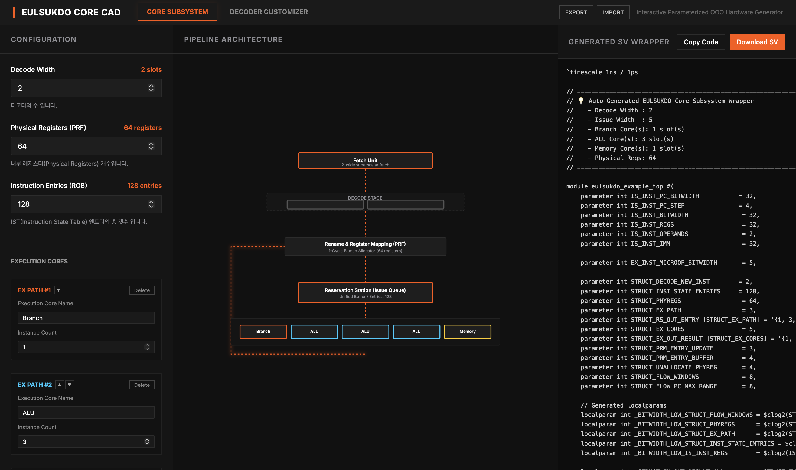

# 을숙도 아키텍쳐 프로젝트 - EULSUKDO Archtecture
**슈퍼스칼라와 비순차 실행 처리를 위한 동적 스케줄링 구현체와**  
**을숙도 아키텍쳐를 확장하고 여러 커스텀 EX를 적용할 수 있는 생성기를 포함한 프로젝트**입니다.
  
[중학생도 읽을만한 쉬운 대화형? 버전](docs/EXPLAIN.md)
  
## 을숙도 아키텍처 프로젝트란?
이 프로젝트는 프로세서가 명령어를 처리하는 과정에서 
여러 명령을 동시에 처리하는 **슈퍼스칼라**와  
순서와 상관없이 실행할 수 있는 명령을 즉시 처리 하는 **레지스터 기반 비순차적 실행 처리**  
구조가 적용된 프로세서를 구현합니다.
이를 <u>**을숙도 아키텍쳐**</u>라고 합니다.

을숙도 아키텍쳐는 확장 가능한 구조로 설계되어  
RTL 코드 부터 확장 가능한 구조로 작성되며,  
<u>파라미터와 EX 모듈의 추가로 커스텀 가능한 프로세서를 생성하는</u>  
**아키텍쳐 생성기**를 구현하는 프로젝트입니다.




### 메인 알고리즘: 토마슬로 알고리즘
명령의 레지스터 체계를 프로세서에서 내부적으로 바꿔 처리하는 **레지스터 리네이밍**을 핵심적으로 사용하고  
알고리즘의 주요 컨셉인 **명령의 상태를 이용**하는 방법을 내부적인 회로로 나누는 구조를 채택합니다.  

## 구현 컨셉
토마슬로 알고리즘이 추구하는 **레지스터 이름 변경**을 적용한  
**비순차 실행 처리를 진행하는 동적 스케줄링 구조**를 만드는것이 최종적인 목표입니다.
이때, Fanout 증가 문제와 전력 소모를 줄이기 위해 CAM이라는 구조를 배제하여 구현해보았습니다.

**레지스터 이름 변경**으로 명령의 레지스터 체계를 바꾸어, 기존에 이름이 겹쳤던 부분을 해소하고자 합니다!

다만, 을숙도 아키텍쳐 프로젝트는 메모리 순서 보장 유닛과 분기예측기는 포함하지 않습니다.  
따라서 CPU로 사용하기에 아직 부적합하며, 이는 추후 *오륙도 아키텍쳐*로 확장하여 구현할 예정입니다.

### 그렇다면 너의 구조는 어떻게 생겼어?
제 구조는 크게 4개의 구역으로 나눌수 있는데,
1. 새롭게 들어온 명령을 해석하고 새로운 레지스터 체계로 바꾸는 부분
2. 현재 명령들의 상태를 기록해 두고, 실행할 준비가 된 명령을 연산/메모리접근 부분으로 넘겨주는 부분
3. 바뀐 레지스터 체계를 기준으로, 해당 레지스터가 사용되는 명령을 저장하고, 상태를 변경하는 부분
4. 현재 명령의 순서와 수행된 명령을 확인하여 지울수 있는 레지스터를 제거(할당 취소)하는 부분

으로 나눌 수 있어요.

그래서, 이를 구현하기 위해 6개의 모듈로 나누었습니다.
- New Entry Logic
- Instruction State Table
- Physical Register Mapper
- Ready Station
- Write Back Concatenation
- Flow Control Logic

[**자세히 알아보려면 여기로**](docs/structure/Top.md)

## 이 저장소는 어떻게 봐야돼?
저장소에
1. [을숙도 아키텍쳐에 대한 설명](docs/)
2. [파라미터화 된 을숙도 아키텍쳐와 생성기](gen/)
3. [을숙도 아키텍쳐의 논리적 동작을 확인하기 위해 사용한 소스코드](structure_src/)

가 저정되어 있습니다. 

구체적으로 디렉토리를 설명하면
```Plain-text
gen/ : 을숙도 아키텍쳐 커스텀 도구에 관련된 디렉토리입니다. 
  generator-app/ : 웹앱으로 만들어진 을숙도 아키텍쳐에 대한 생성기에 대한 디렉토리 입니다.
  prompt/ : 을숙도 아키텍쳐에서 사용할 커스텀 ISA 디코더와 EX 실행 유닛의 RTL을 생성하기 위한 대한 LLM용 프롬프트입니다.
            특히 인터페이스에 관한 정보가 저장되어 있습니다.
  src/ : 확장 가능한 을숙도 아키텍쳐에 RTL코드와 Testbench 코드를 가지고 있습니다.
docs/ : 을숙도 아키텍쳐의 설명을 위한 여러 문서들을 가지고 있는 디렉토리입니다.
  img/ : 문서에서 사용되는 이미지들이 들어있는 디렉토리입니다.
  structure/ : 을숙도 아키텍쳐의 구조에 대해 설명하는 디렉토리입니다.
src/ : 검증용 소스코드입니다.
  RTL/ : 논리/동작 검증을 위해 베릴로그로 작성된 RTL 코드들 입니다.
      RTL/1decode3issue : 힌번에 최대 하나의 명령을 해석하고, 
                          ALU / 점프와 분기 / 메모리 접근의 실행유닛을 가지는
                          작은 을숙도 아키텍쳐 코드입니다.
  TB/  : RTL/의 모듈들을 검증하기 위한 Testbench가 있는 디렉토리 입니다.
```
