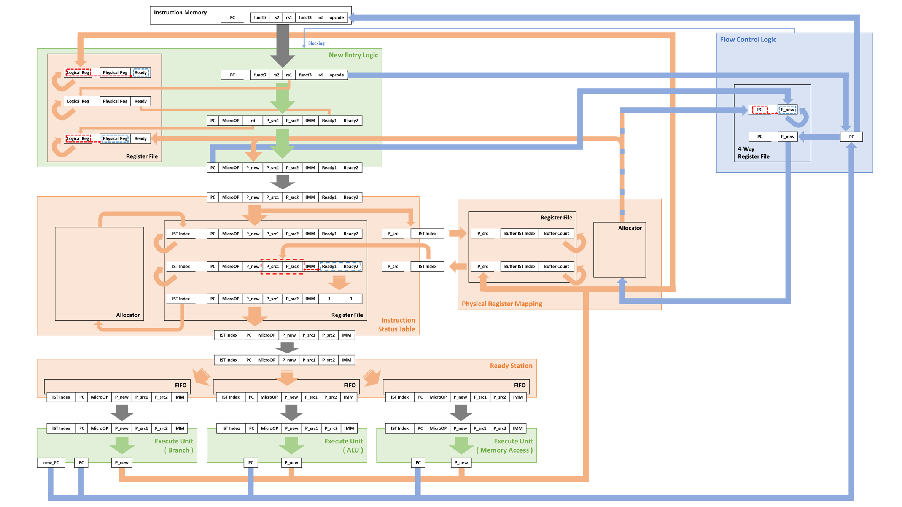

# 을숙도 아키텍쳐 - EULSUKDO Archtecture (중학생도 읽을만한 쉬운 대화형? 버전)
**슈퍼스칼라와 비순차 실행 처리를 위한 동적 스케줄링 구현체**
  
## 이건 뭐에요?
이 프로젝트는 프로세서가 명령어를 처리하는 과정에서 
**여러 명령을 동시에 처리**하고  
**순서와 상관없이 지금 바로 실행할 수 있는 명령을 즉시 처리**하는  
구조가 적용된 프로세서를 구현하는 프로젝트입니다.   

<u>**근데 아직 완성이 안됐어요..**</u>
```Plain-txt
상태 표시 방법
  v 완료 (검증까지)
  ? 검증되지 않음
  - 내용 작성중
  x 시작되지 않음

[현재 작업 현황]
README
  v 배경 설명부분
  - 전체 다이어그램: 현재 다이어그램은 FCL, WBC가 반영되지 않은 버전
  v 각 모듈별 설명
  x 타 아키텍쳐와 비교 분석
  - 진지하게 다시 쓰기
CODE-Memory and Position Splitter or FIFO Element
  v Memory
  v Position Splitter
  v FIFO
  v Multi_data i/o FIFO
  v Allocator
  v Allocator, Value Start 1
CODE-Architecture
  v Rv32I Decoder and IMM
  ? NEL
  v IST
  ? PRM
  ? RS
  v WBC
  v FCL
  x Top Module
```

### 프로세서를 만든다고요? 그게 뭔데요?
프로세서는 **명령 단위로 나눠진 특정한 동작들을 처리하는 디지털 회로**입니다. 대표적으로 CPU와 GPU가 유명하죠.  

프로세서는 명령을 처리할 때, 값을 특정한 공간에 넣어 처리합니다.  
우리는 이를 **레지스터**라고 부르는데요,  
이 레지스터들을 반복적으로 읽고, 쓰면서 원하는 동작을 만들어냅니다.  
사실상 명령은 *레지스터를 읽어 또 다른 레지스터에 새로운 값을 쓰는 동작*이죠.  
그래서, 명령은
1. 어떤 레지스터를 읽을지
2. 읽어온 레지스터 값을 어떻게 다룰지
3. 어떤 레지스터에 쓸지

를 가집니다.

명령들을 조합하면서 다양한 동작을 만들어 내는데,  
이러한 명령을 가져와서 <u>적절한 순서</u> 배치해 둔것을 **소프트웨어**라 부릅니다.  

그래서 프로세서는 이 명령을 **순서대로 처리하면서** 소프트웨어라는 동작을 진행하는 것입니다.  

### 과거에도 이런 구조가 있었나요? 특히 너가 만드는 프로세서라는 것의 구조로?
네! 심지어 지금 당신이 사용하고 있는 컴퓨터/스마트폰에도 사용되고 있습니다.  
여러 명령을 동시에 처리하는 구조는 흔히 **슈퍼스칼라**라는 명칭으로 알려져 있고  
순서와 상관없이 지금 바로 실행할 수 있는 명령을 즉시 처리하는 방법은 **비순차 실행 처리**로 
알려져 있습니다.

특히 비순차 실행 처리를 구현하기 위한 유명한 알고리즘으로 **토마슬로 알고리즘**가 있습니다. 

#### 근데 왜 만듬?
비순차 실행 처리와 슈퍼스칼라를 지원하는 프로세서가 오픈소스로 공개된 경우는 거의 없습니다.  
찾아보니, [risc-v boom](https://github.com/riscv-boom/riscv-boom) 정도가 있는것 같네요.  
이런 시도가 별로 없기도 하고 **저는 컴퓨터 한번 만들어 보고 싶거든요.** 그래서 해보고 있습니다.  

### 프로세서는 순서대로 처리하는 거라면서요? 순서대로 잘 처리하는 프로세서를 만들면 되는거 아니에요?
앞서 설명한것과 같이, 명령은 *레지스터를 읽어 또 다른 레지스터에 새로운 값을 쓰는 동작*이죠.  
이때 명령으로 <u>읽어온 레지스터 값을 어떻게 다룰지</u> 결정할 수 있습니다.  

대표적으로는 연산이 있겠죠. 하지만, 필요한 값을 외부에서 가져올 필요도 있을겁니다.  
단순한 계산기를 예로 들었을 때, 연산을 위한 두 값을 외부에서 가져와야 합니다.  
~~그렇지 않으면 내가 원하는 값을 가지고 연산할 수 없잖아요..~~

문제는 여기에 있습니다. 외부에서 값을 가져올 때, 프로세서 기준으로는 너무 느린겁니다..  
#### 엥? 눈 깜짝할 사이에 다 되던데?
당연합니다. 덧셈 연산만 봐도 컴퓨터는 인간의 연산 속도보다 억단위로 빠르거든요.

사람이 버튼 누르는 사이에도 프로세서는 지루하게 기다리고 있습니다.  
이 지루함을 달래기 위해서라도 프로세서가 다른 일을 하면 좋을겁니다.  
너무 감성적으로 얘기했나요?  
약간 수학적으로 설명하면, 1초에 1억개의 연산을 할 수 있는 프로세서가 외부 장치에서 값을 가져오기 위해  
2초에 한번만 연산하게 되는 꼴이 됩니다.  
프로세서 입장에서 외부장치에 값을 가져올 때 2억개의 명령을 수행할 수 있는 시간을 낭비하게 됩니다.. ~~상당하죠?~~  

그래서, 다양한 방법이 연구 되었는데  
여기서 저는 여러 명령을 동시에 처리하는 구조인 **슈퍼스칼라**와  
순서와 상관없이 지금 바로 실행할 수 있는 명령을 즉시 처리하는 방법인 **비순차 실행 처리**가 대표적이였어요.  

앞에서 말한 **토마슬로 알고리즘**은 비순차 실행 처리를 효율적으로 동작하게 하는데, 이를 프로세서에 적용해보고 싶었어요.  

### 기다려야 하는게 그렇게 많아요? 한두개면 기다릴만하지 않나?
네.. 대표적인게 메모리인데, 이 메모리가 프로세서 기준으로는 느린편입니다.  
특히 어떤 정보를 요청하면 바로 오면 좋을텐데, 메모리는 주소도 만들어서 줘야하고..  
이걸 빨리 해보겠다고 메모리 속도도 키우고 대역폭을 키우기도 하며  
(속도랑은 다르게 한번에 전송되는 양입니다.  
호스로 치면 수압이 세면 속도가 빠르다고 할수 있고, 호스 직경이 크면 대역폭이 크다고 할 수 있어요),  
캐시라는 또다른 구조도 사용하지만,  
최근 하나의 반도체 칩에 여러 프로세서를 집어 넣고.. 엄청 많이 넣는 구조를 사용하게 되면서,  
각각의 프로세서가 기다릴 일이 많아졌습니다.. 

해결법이 있긴한데, 소프트웨어를 기막히게 최적화 시키면 됩니다만, 이게 여간 쉬운일은 아니죠..  
(데이터 자체가 커진다면 얄짤 없기도 하고..)  

참고로, 최근의 많은 프로세서가 외부장치를 메모리 접근하는것 처럼 정보를 주고 받아서,  
뒤에서 설명할때는 외부장치 접근을 **메모리 접근**으로 설명 하겠습니다.

### 왜 슈퍼스칼라와 비순차 실행 처리를 합쳐서 구현하려고 해요?
~~욕심이요.. 을숙도 아키텍쳐라는걸 처음 만든 개발자의 욕심이 불러온..~~  
프로세서가 동시에 하나의 동작만 수행한다면, 하나의 명령어 멈춰버릴겁니다.  
특히 외부에서 값을 가져온다고 하면, 프로세서가 값을 기다리기만 하겠죠?  
그래서 동시에 여러 동작을 수행할 수 있는 **슈퍼스칼라** 구조를 사용할 겁니다.  

그런데, 만약 뒤따르는 명령들이 기다리는 값을 이용한다면, 동시에 여러 동작을 해봤자 의미가 없죠..  
(다 기다려야 할거 아닙니까?)  
그래서 이미 준비된 레지스터를 사용하는 명령부터 처리하게 하면 소프트웨어를 구동의 전체 시간은 줄어들겁니다!  
(팀플하는데 다른 사람의 작업물을 받아서 해야한다면 팀원이 완성해서 보내줄때까지 기다려야 하니까,  
지금 할 수 있는 다른 일을 하는겁니다)  
그래서 **비순차 실행 처리**를 적용할 거에요.  

그러니까, **슈퍼스칼라**는 구조로, **비순차 실행 처리**는 동작으로 적용해보겠다는 의미입니다.

### 토마슬로 알고리즘?
무슨 거창한 알고리즘일까요?  
중요한 알고리즘이지만, 제가 생각하는 가장 중요한 부분은 **명령의 레지스터 체계를 프로세서에서 내부적으로 바꿔 처리**하는 겁니다.  
명령의 레지스터 체계는 Instruction Set이라는 곳에서 정했는데,  
여기의 레지스터는 개수가 한정적이고 비교적 적어 소프트웨어들은 같은 레지스터를 덮어 쓰면서 재사용합니다.  
그래서 토마슬로 알고리즘은 내부적으로 바뀐 레지스터 체계를 이용합니다.  
거창한건 아니고, 그냥 Instruction Set에 있는 레지스터에 비해 더 많은 레지스터 번호를 사용하고,  
이 레지스터 번호로 처리하는 겁니다.  
또한, 이 프로세서의 설계에서 핵심인 **명령의 상태를 이용하는 컨셉**을 여기서 따왔습니다.

## 그러면 너는 뭘 만든건데?
**을숙도 아키텍쳐**는 프로세서가 명령어를 처리하는 과정에서 
**여러 명령을 동시에 처리**하거나  
**순서와 상관없이 지금 바로 실행할 수 있는 명령을 즉시 처리**하는  
구조가 적용된 프로세서를 구현하는 프로젝트입니다.  

그래서, 토마슬로 알고리즘이 추구하는 **레지스터 이름 변경**을 적용한  
**비순차 실행 처리를 진행하는 동적 스케줄링 구조**를 만들었습니다!  
이때, 전력 소모를 줄이기 위해 CAM이라는 구조를 배제하여 구현해보았습니다.

특히 명령의 레지스터 체계를 바꾸어, 기존에 이름이 겹쳤던 부분을 해소하고자 합니다!

### 그렇다면 너의 구조는 어떻게 생겼어?
제 구조는 크게 4개의 구역으로 나눌수 있는데,
1. 새롭게 들어온 명령을 해석하고 새로운 레지스터 체계로 바꾸는 부분
2. 현재 명령들의 상태를 기록해 두고, 실행할 준비가 된 명령을 연산/메모리접근 부분으로 넘겨주는 부분
3. 바뀐 레지스터 체계를 기준으로, 해당 레지스터가 사용되는 명령을 저장하고, 상태를 변경하는 부분
4. 현재 명령의 순서와 수행된 명령을 확인하여 지울수 있는 레지스터를 제거(할당 취소)하는 부분

으로 나눌 수 있어요.

그래서, 이를 구현하기 위해 6개의 모듈로 나누었습니다.
- New Entry Logic
- Instruction State Table
- Physical Register Mapper
- Ready Station
- Write Back Concatenation
- Flow Control Logic

자세히 설명해볼까요?  

일단 전체 구조는 아래와 같아요  

**잠시만요! Write Back Concatenation와 Flow Control Logic이 제대로 표현되지 않은 이전버전입니다! 곧 수정할께요**



#### New Entry Logic(NEL)
**새롭게 들어온 명령을 해석하고 새로운 레지스터 체계로 바꾸어 주는 모듈**입니다!  

이 모듈은 *Instruction Memory*, **Instruction State Table**, **Physical Register Mapper**, **Write Back Concatenation**, **Flow Control Logic**과 연결되어 있습니다.
```Plain-text
Instruction Memory
[받는 정보]
 - 새로운 명령

Instruction State Table
[보내는 정보]
 - 내부 처리용으로 변경되고 새로운 레지스터 체계로 바뀐 명령

Physical Register Mapper
[받는 정보]
 - 새로운 레지스터 체계의 비어있는 레지스터 번호

Write Back Concatenation
[받는 정보]
 - 처리가 완료된 레지스터 번호

Flow Control Logic
[보내는 정보]
 - Jump, 분기 명령어 여부 전달
 - 덮어 씌워지는 명령 레지스터가 할당되었던 기존 레지스터 번호
```

내부에 명령 레지스터 번호와 변경된 레지스터 체계에서의 번호간의 매핑과 준비 상태를 기록해둔 **Register File**이 있습니다.

#### Instruction State Table(IST)
**현재 명령들의 상태를 기록해 두고, 필요시 상태를 변경하며, 실행할 준비가 된 명령을 알리는 모듈**입니다!  

이 모듈은 **New Entry Logic**, **Physical Register Mapper**, **Ready Station**과 연결되어 있습니다.
```Plain-text
New Entry Logic
[받는 정보]
 - 내부 처리용으로 변경되고 새로운 레지스터 체계로 바뀐 명령

Physical Register Mapper
[보내는 정보]
 - 새로운 레지스터 체계로 바뀐 명령에서 필요한 레지스터 번호와 IST 번호
[받는 정보]
 - 상태가 변경되는 IST 번호와 변경시킨 레지스터 번호

Ready Station
[보내는 정보]
 - 준비가 완료된 명령
```

내부에 명령과 상태를 저장해두는 **Register File**이 있고, 이 Register File의 엔트리를 할당하는 **allocator**가 있습니다.  

#### Physical Register Mapper(PRM)
**바뀐 레지스터 체계를 기준으로, 해당 레지스터가 사용되는 명령을 저장하는 모듈**입니다!  

이 모듈은 **New Entry Logic**, **Instruction State Table**, **Write Back Concatenation**, **Flow Control Logic**과 연결되어 있습니다.
```Plain-text
New Entry Logic
[보내는 정보]
 - 새로운 레지스터 체계의 비어있는 레지스터 번호

Instruction State Table
[받는 정보]
 - 새로운 레지스터 체계로 바뀐 명령에서 필요한 레지스터 번호와 IST 번호
[보내는 정보]
 - 상태가 변경되는 IST 번호와 변경시킨 레지스터 번호

Write Back Concatenation
[받는 정보]
 - 처리가 완료된 레지스터 번호

Flow Control Logic
[받는 정보]
 - 이후에 사용되지 않을 레지스터 번호
```

내부에 특정 레지스터가 사용하는 IST의 주소와 갯수가 저장된 **Register File**이 있고, 새로운 체계의 레지스터 번호를 할당하는 **allocator_start_one**(레지스터 0번은 "0" 값으로 고정할거거든요)가 있습니다.

#### Ready Station(RS)
**실행할 준비가 된 명령을 연산/메모리접근 부분으로 넘겨주는 모듈**입니다!  

이 모듈은 **Instruction State Table**, *Execution Unit으로 통칭되는 연산/메모리 접근/명령순서 제어부*와 연결되어 있습니다.
```Plain-text
Ready Station
[받는 정보]
 - 준비가 완료된 명령 

Execution Unit으로 통칭되는 연산/메모리 접근/명령순서 제어부
[보내는 정보]
 - 준비가 완료되어 처리를 기다리는 명령
```

내부에 RS로 입력받아 처리를 기다리는 명령을 저장해둔 **FIFO**가 있습니다.

#### Write Back Concatenation(WBC)
**처리가 완료된 명령의 정보를 전달하는 모듈**입니다!  

이 모듈은 *Execution Unit으로 통칭되는 연산/메모리 접근/명령순서 제어부*, **Physical Register Mapper**, **New Entry Logic**, **Flow Control Logic**과 연결되어 있습니다.
```Plain-text
Execution Unit으로 통칭되는 연산/메모리 접근/명령순서 제어부
[받는 정보]
 - 처리가 완료된 명령의 주소(PC) 및 레지스터 번호와 결과의 일부
   (Branch의 경우 새롭게 가져올 명령어의 주소:PC)
 
Physical Register Mapper
[보내는 정보]
 - 처리가 완료된 레지스터 번호

New Entry Logic
[보내는 정보]
 - 처리가 완료된 레지스터 번호

Flow Control Logic
[보내는 정보]
 - 처리가 완료된 명령어 주소
```

이건 EX의 출력에서 레지스터 번호들을 묶어 외부로 전달합니다. Branch EX등 특수목적 EX에는 추가 값을 따로 떼서 외부로 전달하기도 해요.

#### Flow Control Logic(FCL)
**현재 명령의 순서와 수행된 명령을 확인하여 지울수 있는 레지스터를 제거(할당 취소)하는 모듈**입니다!  

이 모듈은 **New Entry Logic**, **Physical Register Mapper**, **Write Back Concatenation**, *Instruction Memory*와 연결되어 있습니다.
```Plain-text
New Entry Logic
[받는 정보]
 - Jump, 분기 명령어 여부 전달
 - 덮어 씌워지는 명령 레지스터가 할당되었던 기존 레지스터 번호
 
Physical Register Mapper
[보내는 정보]
 - 이후에 사용되지 않을 레지스터 번호

Write Back Concatenation
[받는 정보]
 - 처리가 완료된 명령어 주소

Instruction Memory
[보내는 정보]
 - 새롭게 가져올 명령어의 주소:PC
```

내부에는 레지스터 반환을 위한 구조가 여러개 배치되어 있는데, 그 구조를 설명하자면  
PC의 시작값/마지막값을 저장하는 레지스터와 그 사이에 몇개의 명령이 처리되었는지 카운팅 하고, 그 사이에서 덮어 쓰여진 레지스터들의 번호를 저장해 둔 **FIFO**가 있습니다.  
PC의 시작값-마지막값 사이에 모든 명령이 완료된다면, 그 부분의 FIFO에 저장되었던 레지스터 번호들을 PRM으로 보내서 반환 시켜버리고, 해당 부분을 초기화 시켜 새로운 PC의 시작값-마지막값으로 할당할 수 있도록 합니다.  
이때 시작값-마지막값이 제법 클수 있으니 제한으로 레지스터 체계에서 사용가능한 레지스터 숫자의 절반까지(예를들어 레지스터가 최대 64개라면 32개까지) 명령의 PC의 범위를 지정할 수 있도록 합니다.

### 특별해 보이는 모듈이 있는데, position_splitter? fifo_ordering_position? allocator? 이거 뭐야?
이번 프로세서를 구현하면서 디지털 회로로 정렬기를 만들었는데, 그게 position_spliter입니다.  
이 회로를 사용해서, 최대 m개의 입력과 최대 n개의 출력이 가능한 가변 입출력 FIFO를 만들었고,  
이 구조를 이용해서 하드웨어적으로 할당/반환기를 만들었습니다.  
이것들이 각각 fifo_ordering_position, allocator 입니다.  

#### position_splitter
이 모듈은 정렬되지 않은 위치로 입력되는 최대 n개의 데이터를 LSB 방향으로 모아 출력합니다.  
입력으로 최대 n개의 데이터가 들어올 수 있고, 유효한 데이터 위치를 나타내는 n비트의 Valid 신호를 입력받습니다.  
출력으로 최대 n개의 LSB 방향으로 정렬된 데이터가 출력되고, 유효한 데이터 위치를 나타내는 n비트의 Valid 신호를 출력합니다.  

#### fifo_ordering_position
이 모듈은 정렬되지 않은 위치로 입력되는 최대 m개의 데이터를 저장하고,  
LSB 방향으로 모아 정렬된 n개의 데이터를 출력하는 **FIFO Memory** 입니다.  
입력으로 최대 m개의 데이터가 들어올 수 있고, 유효한 데이터 위치를 나타내는 m비트의 Valid 신호를 입력받습니다.  
출력으로 LSB 방향으로 정렬된 최대 n개의 저장된 데이터가 출력되고, 유효한 데이터 위치를 나타내는 n비트의 Valid 신호를 출력합니다.  
가져간 데이터를 나타내기 위해서는 가져갈 비트가 활성화된 n비트의 get 신호를 전달하면 됩니다.  
다음 사이클에서 가져가지 않은 데이터는 재정렬되고 저장되었던 데이터가 뒤쪽으로 채워져서 출력됩니다.  

#### allocator, allocator_start_one
이 모듈은 하드웨어적으로 구현된 숫자 할당/반환기이며, 최대 n개의 숫자를 할당하고 최대 m개의 숫자를 반환할 수 있습니다.  
입력으로 최대 m개의 숫자를 반환할 수 있고, 반환할 숫자의 위치를 나타내는 m비트의 Valid 신호를 입력받습니다.  
출력으로 할당할 수 있는 LSB 방향으로 정렬된 최대 n개의 숫자가 출력되고, 할당 가능한 숫자의 위치를 나타내는 n비트의 Valid 신호를 출력합니다.  
할당하기 위해서는 가져갈 비트가 활성화된 n비트의 get 신호를 전달하면 됩니다.
allocator는 0부터, allocator_start_one는 1부터 할당됩니다!

## 이 저장소는 어떻게 봐야돼?
제가 열심히 만들어 둔 베릴로그 코드를 보셔야죠.  
그러기 위해서 저는 디렉토리를 아래와 같이 나눴어요.  
```Plain-text
RTL/ : 베릴로그로 작성된 RTL 코드들이 있어요
    RTL/1decode3issue : 힌번에 최대 하나의 명령을 해석하고, 
                        3가지 동작 산술과 논리연산/메모리 접근/브랜치 결정을 동시에 진행할 수 있습니다.
                        이 구조로 작성된 코드가 있는 디렉토리입니다.
TB/  : RTL/의 모듈들을 검증하기 위한 Testbench가 있는 디렉토리 입니다.
```

### 잠시만요!
저는 이번 프로젝트를 구현하기 위해 RISC-V의 RV32I 명령어를 적용해두었습니다.  
그래서, 아래 설명은 모두 RV32I 기준으로 작성되어 있습니다!

<u>**근데 지금 완성이 안됐어요..**</u>

## 왜 을숙도임?
부산출생 김해출신이라 을숙도에 좀 친근해요.  
아 을숙도는 부산 강서에 있는 섬이고요, 하단 바로 옆에 있습니다.  
이뻐요. 가보세요.  
근처 오리집도 추천함요. 꿀맛임
