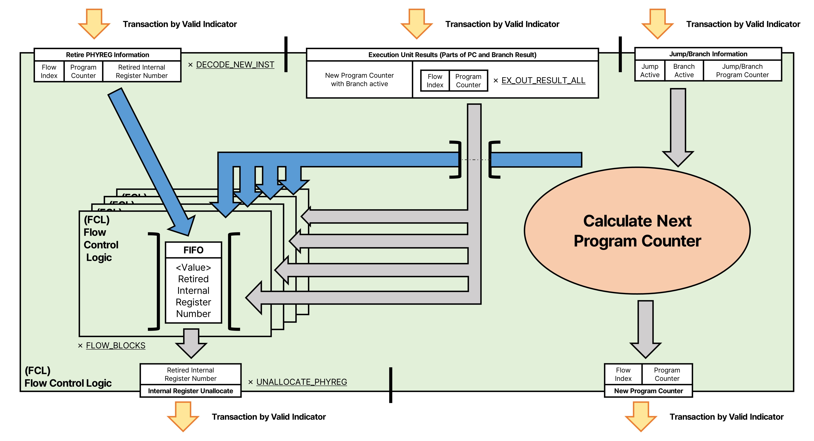

# Flow Control Logic(FCL)
Flow Control Logic은  
명령의 흐름을 결정하기 위해 PC의 변화를 제어하고  
덮어 씌워져 더이상 사용되지 않는 내부 레지스터 번호를 반환하는 모듈입니다.  

## 내부의 구성과 역할
### Flow Detect Unit
명령 윈도우를 추적하고, 완료되면 더이상 사용되지 않는 내부 레지스터 번호를 반환하는 모듈이며,  
내부에 윈도우 범위 비교기와 FIFO를 가지고 있습니다.

### Calculate Next Program Counter
Program Counter를 업데이트 하고, 

## 수신/송신하는 정보

## 데이터 흐름과 예시
