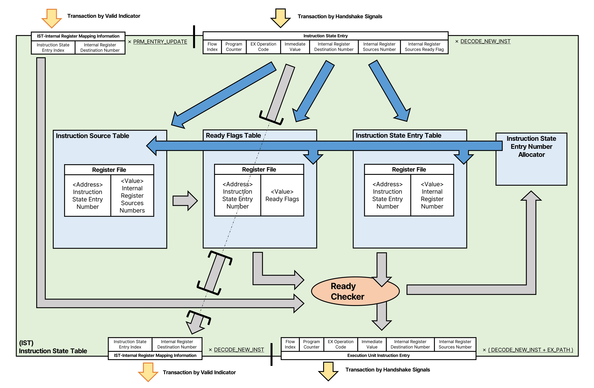

# Instruction State Table(IST)
Instruction State Table은  
입력된 명령에서, 준비된 명령은 처리할 수 있도록 전달하고,  
아직 준비되지 않은 명령은 대기하는 모듈입니다.



## 내부의 구성과 역할
### Instruction State Entry Number Allocator
Instruction State Table의 Entry를 할당하기 위한 Entry 번호 Allocator입니다.  

이 Allocator는 Instruction State Table의 Entry 번호를 출력하고, 사용이 완료된 Entry 번호를 입력받습니다.  
내부 레지스터의 출력으로 ```_BITWIDTH_STRUCT_INST_STATE_ENTRIES```만큼의 너비를 가지고,  
이 정보는 동시에 STRUCT_DECODE_NEW_INST만큼 할당하고, STRUCT_UNALLOCATE_PHYREG만큼 반환 할 수 있습니다.  

BIT_WIDTH(```인자```)는 인자의 log2에서 소수점 아래 값이 있을때 올림한 값입니다.  

### Instruction Entry Table
대기하는 명령을 저장하는 Register File입니다.  
Register File의 주소로 **Instruction State Entry 번호**(너비: ```_BITWIDTH_STRUCT_INST_STATE_ENTRIES```)를 사용하고,   
Register File의 데이터로 **내부 명령**(너비: ```_BITWIDTH_INTERNAL_INST```)을 저장합니다.  

```INTERNAL_INST```의 구조는
|...RS(n~1) Addresses List...|RD Address|Imm Value|Micro-Op|EX Path|Flow Index|Program Counter|
|-|-|-|-|-|-|-|
|[```(_BITWIDTH_STRUCT_PHYREGS*IS_INST_OPERANDS)```-1:0]|[```_BITWIDTH_STRUCT_PHYREGS```-1:0]|[```IS_INST_IMM```-1:0]|[```EX_INST_MICROOP_BITWIDTH```-1:0]|[```_BITWIDTH_STRUCT_EX_PATH```-1:0]|[```_BITWIDTH_STRUCT_FLOW_WINDOWS```-1:0]|[```IS_INST_PC_BITWIDTH```-1:0]|

와 같습니다. 내부 명령의 입력에서 Ready부분만 제외된 형태입니다.

이 Register File 입출력 채널 구성으로
- 입력 채널 갯수: ```STRUCT_DECODE_NEW_INST```
    - 아래부터 IST 모듈에 입력된 순서로 전달하여   
    *Instruction State Entry Number Allocator의 낮은 할당 필드 부터 높은 할당 필드에 출력된 Entry Number* 형태의 주소를 사용하고,  
    동일한 순서로 **입력되는 명령의 위치**(Write Enable)와 **입력되는 내부 명령을 데이터로 입력**합니다.
- 출력 채널 갯수: ```STRUCT_PRM_ENTRY_UPDATE```
    - <u>IST 엔트리 번호</u>를  
    RPM에서 수신된 필드 순서로 전달하여  
    *[IST Entry 1], ... , [IST Entry n]*  
    형태의 주소를 사용하고,  
    동일한 순서로 **저장된 내부 명령이 데이터로 출력**됩니다.  

### Instruction Source Table
대기하는 명령에서 소스로 사용하는 내부 레지스터 번호를 저장하는 Register File입니다.  
Register File의 주소로 **Instruction State Entry 번호**(너비: ```_BITWIDTH_STRUCT_INST_STATE_ENTRIES```)를 사용하고,   
Register File의 데이터로 **소스로 사용되는 내부 레지스터 번호**(너비: ```_BITWIDTH_STRUCT_PHYREGS*IS_INST_OPERANDS```)를 저장합니다.  
 
이 Register File 입출력 채널 구성으로
- 입력 채널 갯수: ```STRUCT_DECODE_NEW_INST```
    - 아래부터 IST 모듈에 입력된 순서로 전달하여   
    *Instruction State Entry Number Allocator의 낮은 할당 필드 부터 높은 할당 필드에 출력된 Entry Number* 형태의 주소를 사용하고,  
    동일한 순서로 **입력되는 명령의 위치**(Write Enable)와 **입력되는 내부 명령을 데이터로 입력**합니다.
- 출력 채널 갯수: ```STRUCT_PRM_ENTRY_UPDATE```
    - <u>IST 엔트리 번호</u>를  
    RPM에서 수신된 필드 순서로 전달하여  
    *[IST Entry 1], ... , [IST Entry n]*  
    형태의 주소를 사용하고,  
    동일한 순서로 **저장된 내부 명령의 소스 레지스터 번호들이 데이터로 출력**됩니다.  

### Ready Flags Table
대기하는 명령에서 준비된 내부 레지스터의 Ready Flag를 저장하는 Register File입니다.  
Register File의 주소로 **Instruction State Entry 번호**(너비: ```_BITWIDTH_STRUCT_INST_STATE_ENTRIES```)를 사용하고,   
Register File의 데이터로 **소스 레지스터 준비 상태**(너비: 1)를 저장합니다.  

이 Register File 입출력 채널 구성으로
- 입력 채널 갯수: ```STRUCT_DECODE_NEW_INST```
    - 아래부터 IST 모듈에 입력된 순서로 전달하여   
    *Instruction State Entry Number Allocator의 낮은 할당 필드 부터 높은 할당 필드에 출력된 Entry Number* 형태의 주소를 사용하고,  
    동일한 순서로 **업데이트하는 Ready Flag의 위치**(Write Enable)와 **업데이트하는 Ready Flag를 데이터로 입력**합니다.
- 출력 채널 갯수: ```STRUCT_PRM_ENTRY_UPDATE```
    - <u>IST 엔트리 번호</u>를  
    RPM에서 수신된 필드 순서로 전달하여  
    *[IST Entry 1], ... , [IST Entry n]*  
    형태의 주소를 사용하고,  
    동일한 순서로 **저장된 Ready Flag가 데이터로 출력**됩니다.  

### IST-PHYREG Mapping Information
입력되는 내부 명령 체계에서 소스 레지스터와 현재 IST 엔트리 번호를 그대로 전달하는 로직으로,  
입력되는 내부 명령 체계의 Ready Flag의 반전을 Valid로 적용합니다.  
즉, **Ready Flag가 활성화 되지 않은 경우만 전달하는 구조**입니다.   

### Ready Checker
PRM에서 수신한 IST 엔트리 번호와 내부 레지스터 번호를 이용하여 Ready Flags Table을 업데이트 하고,  
업데이트 하는 IST 엔트리의 모든 Ready Flag가 활성화 되는 경우 해당 내부 명령을 RS로 전달하는 로직입니다.

## 수신/송신하는 정보
### 소스 레지스터 번호를 대기열에 추가하거나, 사용 가능 상태를 수신
IST는 대기가 필요한 내부 레지스터 번호를 IST 엔트리 번호와 함께 전달하거나,  
준비된 내부 레지스터 번호를 IST 엔트리 번호와 함께 수신받아 실행 가능한 명령 상태로 변경합니다.  

#### 대기가 필요한 내부 레지스터 번호를 IST 엔트리 번호와 함께 PRM으로 전달
새로운 명령이 들어오면 내부 레지스터 번호에 해당하는 대기열에 명령의 IST 엔트리 번호를 저장하기 위해  
내부 레지스터 번호와 명령에 할당된 IST 엔트리 번호를 내보냅니다.  
이때, 데이터의 유효성은 명령의 Ready Flag에 따르며, Ready Flag가 활성화 되지 않는 경우에 Valid 신호를 출력합니다.   

데이터 구조는 MSB부터 LSB 순서로 아래와 같고,
|Instruction State Entry Number|Physical Register Number|
|-|-|
|[```_BITWIDTH_STRUCT_INST_STATE_ENTRIES```-1:0]|[```_BITWIDTH_STRUCT_PHYREGS```-1:0]|

이 정보는 동시에 STRUCT_DECODE_NEW_INST*IS_INST_OPERANDS 만큼 전달할 수 있습니다.  

**Valid 기반 전송**을 사용합니다.  
배포용 소스 코드에서 명칭은 ```i/o_prm_wait_phyreg_*``` 입니다.

#### 준비 완료된 내부 레지스터 번호와 IST 엔트리 번호와 함께 PRM에서 수신
준비가 완료된 내부 레지스터가 있다면, PRM에서 내부 레지스터 대기열에 있던 IST 엔트리를 입력받습니다.    

데이터 구조는 MSB부터 LSB 순서로 아래와 같고,
|Instruction State Entry Number|Physical Register Number|
|-|-|
|[```_BITWIDTH_STRUCT_INST_STATE_ENTRIES```-1:0]|[```_BITWIDTH_STRUCT_PHYREGS```-1:0]|

이 정보는 동시에 STRUCT_PRM_ENTRY_UPDATE 만큼 수신할 수 있습니다.  

**Valid 기반 전송**을 사용합니다.  
배포용 소스 코드에서 명칭은 ```i/o_prm_ready_phyreg_*``` 입니다.

### 새로운 내부 명령을 수신하고, 준비된 내부 명령을 전달
#### 새로운 내부 명령을 NEL에서 수신
새로운 명령을 NEL에서 입력받습니다.  
이때 모든 Operand의 Ready Flag가 활성화 되어 있다면 통과하고, 아니라면 저장합니다.  

데이터 구조는 MSB부터 LSB 순서로 아래와 같고,
|...RS Ready List...|...RS(n~1) Addresses List...|RD Address|Imm Value|Micro-Op|Flow Index|Program Counter|
|-|-|-|-|-|-|-|
|[```IS_INST_OPERANDS```-1:0]|[```(_BITWIDTH_STRUCT_PHYREGS*IS_INST_OPERANDS)```-1:0]|[```_BITWIDTH_STRUCT_PHYREGS```-1:0]|[```IS_INST_IMM```-1:0]|[```EX_INST_MICROOP_BITWIDTH```-1:0]|[```_BITWIDTH_STRUCT_FLOW_WINDOWS```-1:0]|[```IS_INST_PC_BITWIDTH```-1:0]|

이 정보는 동시에 STRUCT_DECODE_NEW_INST 만큼 수신할 수 있습니다.  

**Handshake 기반 전송**을 사용합니다.  
배포용 소스 코드에서 명칭은 ```i/o_nel_newinst_*``` 입니다.

#### 준비된 내부 명령을 RS로 전달
준비된 명령을 RS로 내보냅니다.   

데이터 구조는 MSB부터 LSB 순서로 아래와 같고,
|...RS(n~1) Addresses List...|RD Address|Imm Value|Micro-Op|Flow Index|Program Counter|
|-|-|-|-|-|-|
|[```(_BITWIDTH_STRUCT_PHYREGS*IS_INST_OPERANDS)```-1:0]|[```_BITWIDTH_STRUCT_PHYREGS```-1:0]|[```IS_INST_IMM```-1:0]|[```EX_INST_MICROOP_BITWIDTH```-1:0]|[```_BITWIDTH_STRUCT_FLOW_WINDOWS```-1:0]|[```IS_INST_PC_BITWIDTH```-1:0]|

이 정보는 동시에 STRUCT_DECODE_NEW_INST*STRUCT_EX_PATH 만큼 전달할 수 있습니다.  

**Handshake 기반 전송**을 사용합니다.  
배포용 소스 코드에서 명칭은 ```i/o_rs_readyinst_*``` 입니다.

## 데이터 흐름과 예시
