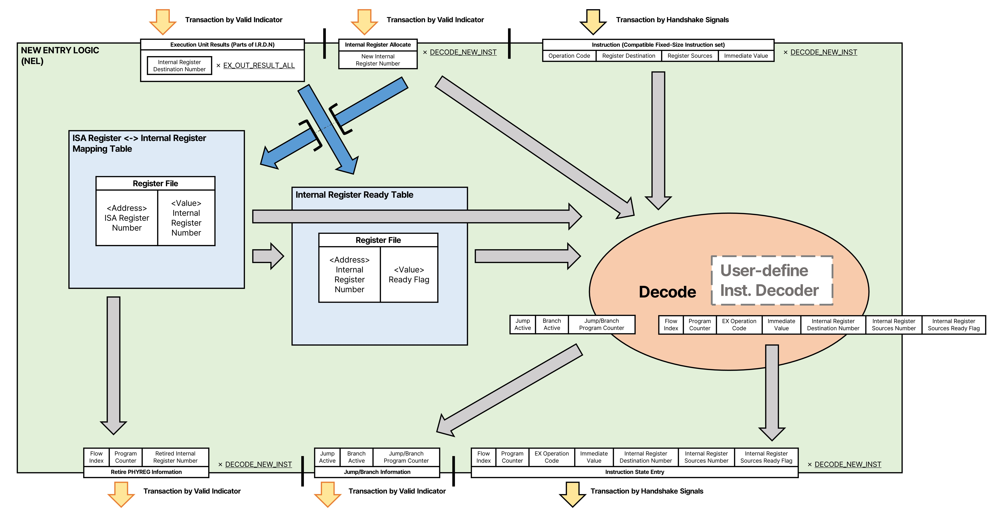

# New Entry Logic(NEL)
New Entry Logic는  
새로운 명령을 입력받아, 이때 명령의 레지스터들을 내부 체계의 이름으로 변경하며,  
새로운 명령에서 필요한 레지스터의 준비여부를 모아 내부에서 처리하는 명령 체계로 변환하는 모듈입니다.



## 내부의 구성과 역할
### 설계자 정의 ISA 디코더
을숙도 아키텍쳐는 설계자가 원하는 형태의 Instruction Set을 사용할 수 있습니다.  
다만, 몇가지 조건이 있습니다.  
- 고정 길이 명령 구조만 사용할 수 있습니다.
- 명령을 구분하는 PC 값의 단위가 반드시 동일하게 구분되어야 합니다.

설계자가 사용할 수 있는 디코더의 입출력 포맷이 고정되어 있습니다.  

명령을 처리하기 위해 설계자가 정의 하는 ISA 디코더는    
입력으로
|Name|Bit-Width|Description|
|-|-|-|
|inst|```IS_INST_BITWIDTH```|Instruction Set 기반의 명령|

을 받고,   

출력으로  
|Name|Bit-Width|Quantity|Description|
|-|-|-|-|
|EX_PATH|BIT_WIDTH(```STRUCT_EX_PATH```)|1|EX 종류 지정|
|Micro-OP|```EX_INST_MICROOP_BITWIDTH```|1|EX용 Opcode|
|RD|BIT_WIDTH(```IS_INST_REGS```)|1|Register Destination|
|Allocate_NEW_RD|1|1|명령이 레지스터를 수정하는지 여부|
|RS|BIT_WIDTH(```IS_INST_REGS```)|```IS_INST_OPERANDS```|Register Sources|
|RS_use|1|```IS_INST_OPERANDS```|사용하는 Register Source 필드|
|Jump|1|1|PC의 값을 레지스터 없이 변경하는 명령 여부, 다음 명령을 불러오는 경우는 포함하지 않음|
|Jump_Reg|1|1|PC의 값을 레지스터를 이용하여 변경하는 명령 여부|
|Branch|1|1|PC의 값을 조건에 따라 변경하는 명령 여부|

가 출력되게 만드셔야 합니다.   
~~[RV32I 디코더]()예제가 있습니다. 해당 구성으로 I/O를 만들면 됩니다..~~  
이 디코더는 총 ```STRUCT_DECODE_NEW_INST```개 만큼 존재하게 됩니다.

BIT_WIDTH(```인자```)는 인자의 log2에서 소수점 아래 값이 있을때 올림한 값입니다.  

위와 같은 형태를 맞춰 <u>설계자 정의 ISA 디코더</u>를 설계한다면,  
제공하는 생성기로 바로 을숙도 아키텍쳐에서 사용할 수 있습니다.  

### ISA Register <-> Physical Register Mapping Table
Instruction Set Architecture에 정의 된 레지스터와 내부 레지스터 간의 매핑 관계를 저장하는 Register File입니다.  
Register File의 주소로 **Instruction Set 레지스터 번호**(너비: ```_BITWIDTH_IS_INST_REGS```)를 사용하고,   
Register File의 데이터로 **내부 레지스터 번호**(너비: ```_BITWIDTH_STRUCT_PHYREGS```)를 저장합니다.  

이 Register File 입출력 채널의 구성으로  
- 입력 채널 갯수: ```STRUCT_DECODE_NEW_INST```
    - 아래부터 NEL 모듈에 입력된 순서로 전달하여  
    *NEL 모듈에 입력된 순서가 가장 낮은 명령 RD 레지스터 번호, ... , 입력되는 가장 높은 순서가 가장 높은 명령 RD 레지스터 번호* 형태의 주소를 사용하고,  
    동일한 순서로 **재할당된 레지스터 필드의 위치**(Write Enable)과 **매핑할 레지스터 값을 데이터로 입력**합니다.
- 출력 채널 갯수: ```(STRUCT_DECODE_NEW_INST*(1+IS_INST_OPERANDS))```
    - <u>명령들의 RS_1 레지스터 번호, ... , 명령들의 RS_n 레지스터 번호, 명령들의 RD 레지스터 번호</u> 묶음을  
    아래부터 명령의 PC 값 순서로 전달하여  
    *[ RS_1 (Inst ```1```) / ... / (Inst ```STRUCT_DECODE_NEW_INST```) ], ~~~ ,*  
    *[ RS_```IS_INST_OPERANDS``` (Inst ```1```) / ... / (Inst ```STRUCT_DECODE_NEW_INST```) ],*  
    *[ RD (Inst ```1```) / ... / (Inst ```STRUCT_DECODE_NEW_INST```) ]*  
    형태의 주소를 사용하고,  
    동일한 순서로 **매핑 된 레지스터 값이 데이터로 출력**됩니다.  

### Physical Register Ready Table
내부 레지스터의 준비 여부를 저장하는 Register File입니다.  
Register File의 주소로 **내부 레지스터 번호**(너비: ```_BITWIDTH_STRUCT_PHYREGS```)를 사용하고,  
Register File의 데이터로 **내부 레지스터의 준비 여부**(너비: 1)를 저장합니다.  

이 Register File 입출력 채널의 구성으로  
- 입력 채널 갯수: ```STRUCT_DECODE_NEW_INST+STRUCT_EX_CORES```
    - 디코더로 입력된 순서와 1번째 EX부터 마지막 EX 순서로  
    *디코딩된 내부 RD 레지스터들의 번호와 EX에서 입력된 레지스터 번호들*의 형태의 주소를 사용하고,  
    동일한 순서로 **초기화/업데이트 할 플래그 필드의 위치**(Write Enable)와 **디코딩 부분은 0, 업데이트 부분은 1을 입력**합니다.  
    디코딩된 내부 RD 레지스터는 초기화용으로, EX에서 입력된 레지스터 번호들은 Ready 플래그 활성화 용으로 사용합니다.
- 출력 채널 갯수: ```(STRUCT_DECODE_NEW_INST*IS_INST_OPERANDS)```
    - <u>내부 레지스터로 변환된 명령의 RS_1 레지스터 번호, ... , 내부 레지스터로 변환된 명령의 RS_n 레지스터 번호</u> 묶음을  
    아래부터 명령의 PC 값 순서로 전달하여  
    *[ (Inst ```1```)PHY RS_1, ... , PHY RS_n ] ~~~ [ (Inst ```STRUCT_DECODE_NEW_INST```)PHY RS_1, --- , PHY RS_n ]* 형태의 주소를 사용하고,  
    동일한 순서로 **매핑 된 레지스터 값이 데이터로 출력**됩니다.  

### Decode
설계자 정의 ISA 디코더, ISA Register <-> Physical Register Mapping Table, Physical Register Ready Table에서 가져온 데이터로  
내부 명령 체계로 변경하는 디코더입니다.  

```STRUCT_DECODE_NEW_INST```가 1개라면 2단계로,
```STRUCT_DECODE_NEW_INST```가 2개 이상이라면 3단계로 진행됩니다.  

#### ```STRUCT_DECODE_NEW_INST```가 한개라면
1. 입력된 명령을 해석(디코딩)하고, 필요하면 새 RD 레지스터를 할당하고,  
현재 상태의 RS 레지스터를 매핑된 내부 레지스터로 변환합니다.
2. 명령을 내부 명령체계로 변환하고,  
Physical Register Ready Table과 현재 입력된 EX 완료 레지스터까지 감안하여 Ready를 출력합니다.

#### ```STRUCT_DECODE_NEW_INST```가 복수라면
**입력된 명령간의 종속성을 확인하는 단계가 추가됩니다.**  
1. 입력된 명령을 해석(디코딩)합니다. 필요하면 새 RD 레지스터를 할당하고, 입력된 명령간의 종속성을 확인합니다.
2. 현재 상태의 RS 레지스터를 매핑된 내부 레지스터로 변환합니다. 이때, 입력된 앞쪽 명령의 RD와 뒤쪽 명령의 RS가 연결된 종속성이 존재하는 상황이라면, 종속성을 고려하여 변환합니다.
3. 명령을 내부 명령체계로 변환하고,  
Physical Register Ready Table과 현재 입력된 EX 완료 레지스터까지 감안하여 Ready를 출력합니다.

종속성 확인을 위해 **병렬 Suffix AND** 회로를 사용합니다.  
규모에 따라 파이프라인 스테이지가 2사이클 이상의 사이클로 변경될 수 있습니다.  

## 수신/송신하는 정보
### 정보 수집 I/O
NEL은 ISA 명령을 내부 명령 체계로 변경하기 위해 여러 부분에 정보를 수집합니다.  

#### 사용 가능한 내부 레지스터 번호를 PRM에서 수신
새로운 명령에서 레지스터 쓰기가 발생한다면, *레지스터 리네이밍*을 위해 새로운 레지스터를 할당받습니다.

데이터 구조는 MSB부터 LSB 순서로 아래와 같고,
|New Physical Register Number|
|-|
|[```_BITWIDTH_STRUCT_PHYREGS```-1:0]|

이 정보는 동시에 STRUCT_DECODE_NEW_INST 만큼 수신할 수 있습니다.  

**Handshake 기반 전송**을 사용합니다.  
**다른 Handshake 기반 전송과 달리, Get 발생에 조건이 있습니다.**
1. 디코딩된 명령이 새로운 레지스터를 요구해야 합니다.
2. 수신되는 Valid가 우선적으로 활성화되어야 하고, 모든 필드가 활성화 되어 있어야 합니다.
3. "새로운 명령을 Instruction Memory에서 수신"하는 부분의 모든 Valid 필드가 활성화 되어야 합니다.
4. "내부 체계로 변경된 명령 코드를 IST로 전달"하는 부분에서 모든 Get 필드가 활성화 되어야 합니다.

이는 외부에서 입력되는 명령의 전달 순서를 보장하기 위해 사용됩니다.  
(순차성이 존재하는 명령 간의 연결을 위해 필수적으로 사용되는 조건들입니다.)  

배포용 소스 코드에서 명칭은 ```i/o_prm_allocate_*``` 입니다.

#### 준비가 완료된 내부 레지스터 번호를 EX에서 수신
EX에서 처리가 완료된 내부 레지스터에 대해 Ready Flag를 관리하기 위해, 완료된 내부 레지스터 번호를 입력받습니다.  

데이터 구조는 MSB부터 LSB 순서로 아래와 같고,
|Ready Physical Register Number|
|-|
|[```_BITWIDTH_STRUCT_PHYREGS```-1:0]|

이 정보는 동시에 STRUCT_EX_CORES 만큼 수신할 수 있습니다.  

**Valid 기반 전송**을 사용합니다.  
배포용 소스 코드에서 명칭은 ```i/o_ex_done_reg_*``` 입니다.

### 새로운 명령을 내부 명령 체계로 변환
NEL은 ISA 명령을 내부 명령 체계로 변경하는 로직을 가지고 있고, 이를 전달하는 인터페이스가 있습니다.  

#### 새로운 명령을 Instruction Memory에서 수신
새로운 ISA 기반의 명령을 입력받습니다.  

데이터 구조는 MSB부터 LSB 순서로 아래와 같고,
|New ISA Instruction|
|-|
|[```IS_INST_BITWIDTH```-1:0]|

이 정보는 동시에 STRUCT_DECODE_NEW_INST 만큼 수신할 수 있습니다.  

**Handshake 기반 전송**을 사용합니다.  
**이 Handshake 신호가 NEL 모듈의 파이프라이닝 시작 신호와 동일합니다.**  
또한, **"내부 체계로 변경된 명령 코드를 IST로 전달"의 Handshake 부분에서 모든 Get 신호가 활성화 되어 있지 않는다면, 모든 필드에서 Get이 발생하지 않습니다.**
배포용 소스 코드에서 명칭은 ```i/o_im_inst_*``` 입니다. 

### 내부 체계로 변경된 명령 코드를 IST로 전달
내부 명령 체계로 변환된 명령를 출력합니다.  

데이터 구조는 MSB부터 LSB 순서로 아래와 같고,
|...RS Ready List...|...RS(n~1) Addresses List...|RD Address|Imm Value|Micro-Op|EX Path|Flow Index|Program Counter|
|-|-|-|-|-|-|-|-|
|[```IS_INST_OPERANDS```-1:0]|[```(_BITWIDTH_STRUCT_PHYREGS*IS_INST_OPERANDS)```-1:0]|[```_BITWIDTH_STRUCT_PHYREGS```-1:0]|[```IS_INST_IMM```-1:0]|[```EX_INST_MICROOP_BITWIDTH```-1:0]|[```_BITWIDTH_STRUCT_EX_PATH```-1:0]|[```_BITWIDTH_STRUCT_FLOW_WINDOWS```-1:0]|[```IS_INST_PC_BITWIDTH```-1:0]|

이 정보는 동시에 STRUCT_DECODE_NEW_INST 만큼 전달할 수 있습니다.  

**Handshake 기반 전송**을 사용합니다.  
**모든 필드의 Get 신호가 발생하지 않는다면, 모든 필드에서 Valid 신호를 전달하지 않습니다.**
배포용 소스 코드에서 명칭은 ```i/o_ist_newinst_*``` 입니다.

### 내부 반환 및 점프/분기 명령 정보를 전달
내부 레지스터 반환을 위해 덮어 씌워지는 내부 레지스터 번호를 전달하고, 명령 윈도우의 재설정을 위해 점프/분기 명령 정보를 내보냅니다.

#### 덮어 씌워지는 내부 레지스터 목록을 FCL로 전달
추후 명령 윈도우가 모두 처리되었을때 사용되지 않는 내부 레지스터 반환을 위해  
덮어 씌워지는 내부 레지스터 번호를 전달합니다.

데이터 구조는 MSB부터 LSB 순서로 아래와 같고,
|Retired Physical Register Number|
|-|
|[```_BITWIDTH_STRUCT_PHYREGS```-1:0]|

이 정보는 동시에 STRUCT_DECODE_NEW_INST 만큼 전달할 수 있습니다.  

**Valid 기반 전송**을 사용합니다.  
배포용 소스 코드에서 명칭은 ```i/o_fcl_unallo_reg_*``` 입니다.

#### 점프/분기 명령 정보를 FCL로 전달
점프/분기가 발생하는 명령 정보를 전달합니다. 디코딩 되는 가장 앞선 점프/분기 명령에 대해서만 전달합니다.
이 정보는 하나만 전달할 수 있습니다.  
**Valid 기반 전송**을 사용하는데, 다른 규격과 달리 주소와 플래그가 전달됩니다.  
- jump[0]: Immediate 값을 이용한 점프 명령 여부
- jump_reg[0]: 레지스터 값을 이용한 점프 명령 여부
- branch[0]: 분기 명령 여부
- new_pc[```IS_INST_BITWIDTH```-1:0]: 점프/분기로 변경되거나 변경될 수 있는 PC. *단, jump_reg 발생에서는 사용하지 않음*

배포용 소스 코드에서 명칭은 ```i/o_fcl_jump_branch_*``` 입니다.

## 데이터 흐름과 예시
