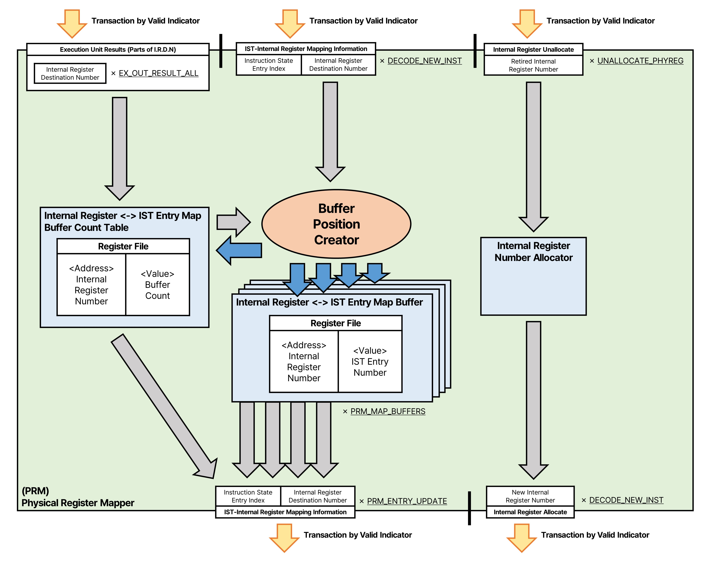

# Physical Register Mapper(PRM)
Physical Register Mapper는  
내부 레지스터 번호를 할당하고, 내부 레지스터에 연결된 명령 대기열을 관리하는 모듈입니다.



## 내부의 구성과 역할
### Internal(Physical) Register Number Allocator
내부 레지스터를 명령에 사용할 수 있도록 할당하기 위한 내부 레지스터 번호 Allocator입니다.  

이 Allocator는 내부 레지스터 번호를 출력하고, 더이상 사용되지 않는 내부 레지스터 번호를 입력받습니다.  
내부 레지스터의 출력으로 ```_BITWIDTH_STRUCT_PHYREGS```만큼의 너비를 가지고,  
이 정보는 동시에 STRUCT_DECODE_NEW_INST*IS_INST_OPERANDS만큼 할당하고, STRUCT_UNALLOCATE_PHYREG만큼 반환 할 수 있습니다.   

### Internal Register <-> IST Entry Map Buffer Count Table
내부 레지스터 번호에 대기중인 명령의 갯수를 저장하는 Register File입니다.
Register File의 주소로 **내부 레지스터 번호**(너비: ```_BITWIDTH_STRUCT_PHYREGS```)를 사용하고,   
Register File의 데이터로 **대기열에 저장된 명령의 수**(너비: ```_BITWIDTH_STRUCT_PRM_ENTRY_BUFFER```)를 저장합니다.  

이 Register File 입출력 채널 구성으로
- 입력 채널 갯수: ```STRUCT_DECODE_NEW_INST*IS_INST_OPERANDS```
    - 아래부터 IST 모듈에 입력된 순서로 전달하여   
    *Operand에 사용된 내부 레지스터 주소를 입력된 명령과 Operand 순서로 묶인* 형태의 주소를 사용하고,  
    동일한 순서로 **업데이트 되는 명령의 Operand 위치**(Write Enable)와 **업데이트 이후 카운터 값을 데이터로 입력**합니다.
- 출력 채널 갯수: ```(STRUCT_DECODE_NEW_INST*IS_INST_OPERANDS)+_STRUCT_EX_OUT_RESULT_ALL```
    - <u>카운터 값</u>을  
    IST의 Operand 묶음의 명령들, EX의 번호 순서대로 전달받아 주소를 사용하고,  
    동일한 순서로 **저장된 카운터 값이 데이터로 출력**됩니다. 

### Internal Register <-> IST Entry Map Buffer

### Buffer Position Creator

### Output FIFO (Variable I/O Fields)


## 수신/송신하는 정보
### 새로운 레지스터를 할당하고 반환

### 내부 레지스터 번호에 연결된 명령 대기열에 레지스터를 추가

### 완료된 내부 레지스터 번호에 연결된 대기열의 명령들을 전달

## 데이터 흐름과 예시
