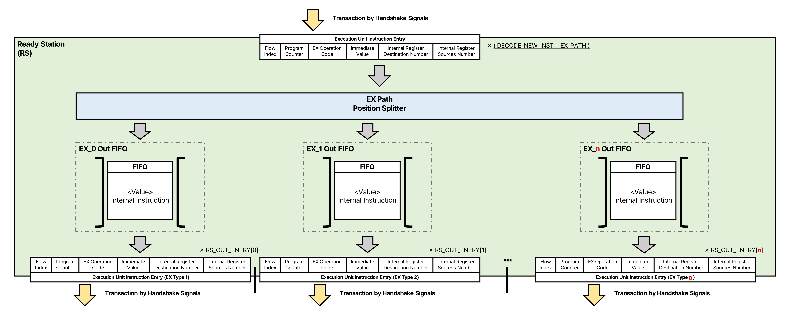

# Ready Station(RS)
Ready Station은  
준비된 명령이 EX에서 처리되도록  
내부 명령이 대기하는 모듈입니다.  



## 내부의 구성과 역할
### EX Path Position Splitter
EX Path와 맞는 FIFO에 내부 명령을 전달하기 위한 Position Spliter 입니다.  
내부적으로 **EX Path**로 할당된 Position Spliter가 있고, 입력에서 명령의 **EX Path** 필드와 비교하여  
내부의 Position Spliter 번호와 동일한 경우 입력이 유효하도록 로직이 구성되어 있습니다.  
(EX Path 번호와 내부의 Position Spliter 번호가 동일해야 내부의 Position Spliter의 Valid가 발생하도록 설계됩니다)

### EX Path FIFO
특정한 EX Path로 향하는 명령이 버퍼링 되는 FIFO 입니다.
FIFO의 데이터는 (LSB에서 MSB로)  
|Program Counter|Flow Index|Micro-Opcode|Immediate Value|RD Address|...RS(1~n) Addresses List...|...RS(1~n) Values List...|
|-|-|-|-|-|-|-|
입니다.

이 FIFO 입출력 채널 구성으로
- 입력 채널 갯수: ```STRUCT_DECODE_NEW_INST```

- 출력 채널 갯수: ```STRUCT_RS_OUT_ENTRY[FIFO의 EX_PATH]```
