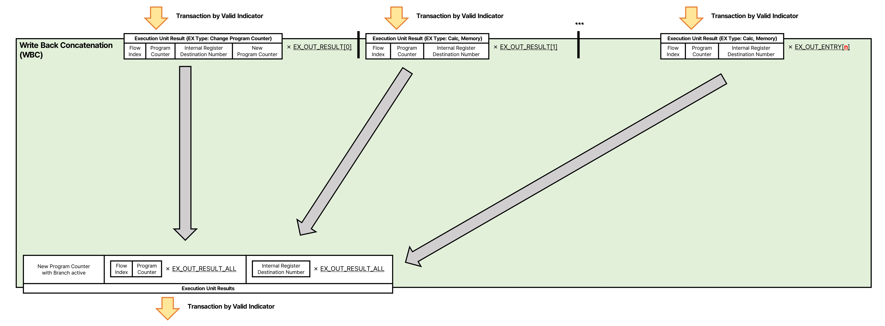

# Write Back Concatenation
Write Back Concatenation은  
EX에서 처리가 완료된 결과의 Flow Index, PC와  
내부 레지스터 번호를 추출하여 전달하는 모듈입니다.  



**입력을 분할하여 출력으로 전달하는 구조를 가지기 때문에 내부의 구성과 역할을 따로 서술하지 않습니다.**  
**이 부분은 조합 논리로만 만들어집니다.**

## 수신/송신하는 정보
### 처리가 완료된 결과의 Flow Index, PC, 내부 레지스터 번호를 추출해 전달
WBC는 EX에서 완료된 결과의 Flow Index, PC, 내부 레지스터 번호를 추출하고,  
추출한 결과의 Flow Index, PC, 내부 레지스터 번호를 NEL, PRM, FCL에 전달합니다.  

#### 처리가 완료된 결과를 EX에서 수신
처리가 완료된 결과를 EX들에서 입력받습니다.  
EX의 결과과 출력된 위치는 유효한 데이터 필드와 동일하며,  
EX에 종류에 따라 데이터 필드의 구조는 바뀔 수 있습니다.  

데이터 구조는 두가지이며, 첫번째는 분기 EX의 결과이고, 두번째는 일반적인 EX의 결과입니다.  
MSB부터 LSB 순서로 아래와 같고,  
(분기 EX의 결과)  
|New Program Counter|Branch Active|RD Address|Flow Index|Program Counter|
|-|-|-|-|-|
|[```IS_INST_PC_BITWIDTH```-1:0]|[0]|[```_BITWIDTH_STRUCT_PHYREGS```-1:0]|[```_BITWIDTH_STRUCT_FLOW_WINDOWS```-1:0]|[```IS_INST_PC_BITWIDTH```-1:0]|

(일반적인 EX의 결과)  
|RD Address|Flow Index|Program Counter|
|-|-|-|
|[```_BITWIDTH_STRUCT_PHYREGS```-1:0]|[```_BITWIDTH_STRUCT_FLOW_WINDOWS```-1:0]|[```IS_INST_PC_BITWIDTH```-1:0]|

이 정보는 동시에 _STRUCT_EX_OUT_RESULT_ALL 만큼 수신할 수 있습니다.  

**Valid 기반 전송**을 사용합니다.  
배포용 소스 코드에서 명칭은 ```i/o_ex_result_*``` 입니다.  

#### 처리가 완료된 결과의 Flow Index, PC, 내부 레지스터 번호를 NEL, PRM, FCL으로 전달
입력 받은 결과에서 Flow Index, PC, 내부 레지스터 번호를 NEL, PRM, FCL으로 내보냅니다. 각각 내보냅니다.  

Flow Index와 PC, 내부 레지스터 번호의 전송단위를 각각 나누어 전달합니다.  
동일한 단위를 묶어 전달합니다. 단, 한쪽으로 모아서 전달하지 않습니다.  
즉, 유효한 필드가 띄엄띄엄 존재할 수 있습니다.  
(Flow Index와 PC)
|Flow Index|Program Counter|
|-|-|
|[```_BITWIDTH_STRUCT_FLOW_WINDOWS```-1:0]|[```IS_INST_PC_BITWIDTH```-1:0]|

(내부 레지스터 번호)
|RD Address|
|-|
|[```_BITWIDTH_STRUCT_PHYREGS```-1:0]|

이 정보는 동시에 _STRUCT_EX_OUT_RESULT_ALL 만큼 전달할 수 있습니다.  

**Valid 기반 전송**을 사용합니다.  
배포용 소스 코드에서 명칭은 ```i/o_(nel/prm/fcl)_(pc/phyreg)_*``` 입니다.  

#### 처리가 완료된 Branch 결과를 FCL으로 전달
Branch EX에서 출력된 결과를 FCL로 내보냅니다.  

데이터 구조는 MSB부터 LSB 순서로 아래와 같고,
|New Program Counter|Branch Active|
|-|-|
|[```IS_INST_PC_BITWIDTH```-1:0]|[0]|

이 정보는 **오직 하나입니다.**  

**Valid 기반 전송**을 사용합니다.  
배포용 소스 코드에서 명칭은 ```i/o_fcl_branch_*``` 입니다.  

## 데이터 흐름과 예시
