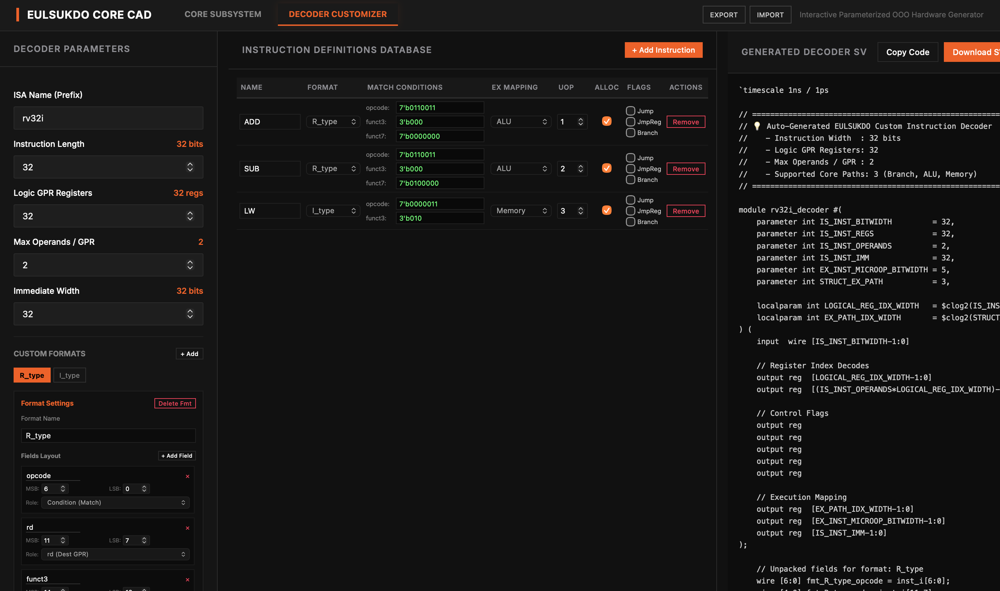
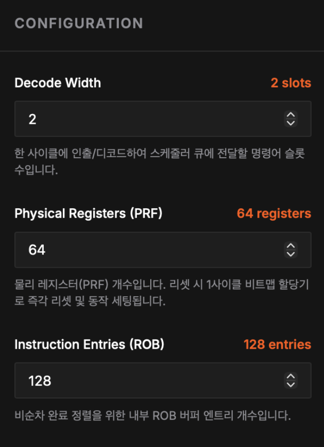
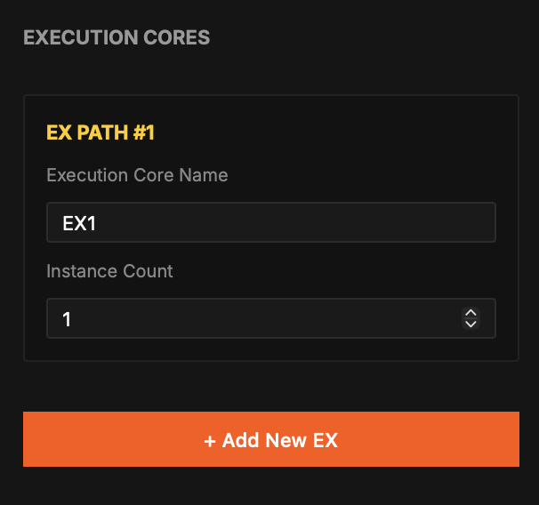
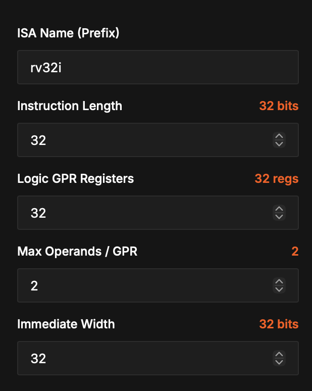
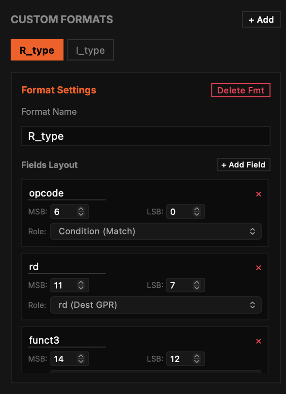
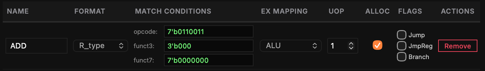

# 을숙도 아키텍쳐 생성기 - EULSUKDO Archtecture Generator
동적 스케줄링에 사용되는 컴포넌트 갯수와 Instruction Set의 정보를 입력하여  
**을숙도 아키텍쳐가 적용된 프로세서를 생성하는 도구**입니다.  

**[구조 수정 페이지]**

**[ISA 수정 페이지]**

이 툴의 상단에서 **컴포넌트 수를 수장**하고, **Instruction Set을 설정**하는 메뉴를 선택할 수 있고,  
우측에 설정 정보를 JSON으로 저장 하거나 불러올 수 있습니다.

## 을숙도 아키텍쳐의 컴포넌트 구성을 수정하는 법
을숙도 아키텍쳐는 확장 가능한 구조를 적용한 프로세서 구조 입니다.  
그래서 **CORE SUBSYSTEM 메뉴**로 을숙도 아키텍쳐의 컴포넌트 구성에 대한 파라미터를 조작할 수 있습니다.  

왼쪽은 파라미터를 수정하는 부분이고,  
중간은 시각화 된 OoOE의 부분이며(OoOE를 이해하고 있는 사람이 사용하는 것을 기준으로 만들었습니다.),  
오른쪽은 해당 구성에 맞는 SystemVerilog 코드를 보여주고 저장할 수 있도록 합니다.

수정할 수 있는 요소로  
1. 한번에 명령을 변환하는 디코더 수를 변경할 수 있습니다.
2. 내부 레지스터 수를 변경할 수 있습니다.
3. Instruction State Table의 Entry 수를 변경할 수 있습니다.

이 값은 왼쪽 **CONFIGURATION** 탭 상단에서 수정할 수 있습니다. 

또한, 실행 유닛의 종류를 추가하고 갯수를 설정할 수 있습니다.  

## 프로세서에 사용될 Instruction Set을 설정하는 법
을숙도 아키텍쳐는 고정 길이 명령이라면 어떤 명령어 체계든 사용 할 수 있는 프로세서 구조 입니다.  
그래서 **DECODER CUSTOMIZER 메뉴**로 프로세서의 디코더를 제작할 수 있습니다.  

왼쪽은 명령의 전체 속성을 수정하는 부분이고,  
중간은 왼쪽 구성에 맞는 명령어 리스트를 작성하는 부분이며,  
오른쪽은 해당 구성에 맞는 SystemVerilog 코드를 보여주고 저장할 수 있도록 합니다.

명령의 속성으로
1. Instruction Set Architecture의 명칭을 지정할 수 있습니다.  
이는 코드에서 모듈 이름으로 사용할 수 있습니다.
2. 명령어의 길이입니다.
3. General Purpose Register의 갯수입니다.
4. 명령에서 사용되는 최대 Operand 수 입니다.
5. 명령이 내포하는 Value의 길이입니다.

이 값은 왼쪽 **CONFIGURATION** 탭 상단에서 수정할 수 있습니다. 

또한, 명령의 구성과 세부 필드 속성을 설정할 수 있습니다.

여기서 사용되는 필드들은
- Condition: 명령을 구분하는 필드입니다.
- rd: 레지스터 목적지를 설정하는 필드입니다.
- rs*: 레지스터 소스를 설정하는 필드입니다.
- imm: 명령이 내포하는 값의 필드입니다.
- none: 해당필드를 사용하지 않을때 선택합니다.

중앙에서는 개별 명령들의 세부 설정이 가능합니다.

- NAME: 명령의 이름입니다.
- FORMAT: 명령의 구성을 선택합니다.
- MATCH CONDITION: 해당 명령이 실행될 Condition Field들의 조건을 작성합니다.
- EX MAPPING: 해당 명령의 동작이 실행될 EX 유닛을 설정합니다.
- UOP: 해당 명령의 동작이 실행될 EX 유닛에서 Opcode 값을 설정합니다.  
이는 다른 명령과 반드시 구분되어야 합니다.
- ALLOC: 목적지 레지스터에 값을 수정하는 경우 사용합니다.
- FLAGS: 점프/분기에서 사용하는 조건입니다.
    - Jump: 즉시 점프되는 PC값이 설정되는 명령인 경우 사용합니다.
    - JmpReg: 레지스터 값을 이용하여 PC값이 설정되는 점프 명령인 경우 사용합니다.
    - Branch: 분기 명령인 경우 사용합니다.
- ACTIONS: 명령 삭제 버튼이 있습니다.
